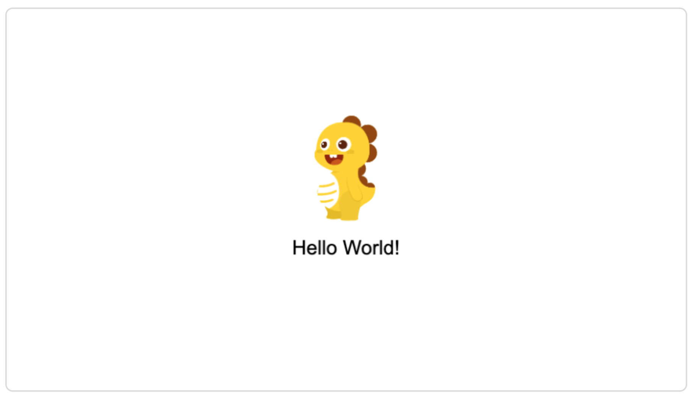

# 示例介绍
在使用 VF-CLI 创建并运行的内置示例后，接下来我们展开内部的实现逻辑，来看看如何用 VF 做到这一切的。

::: tip 提示💡
更完整的示例和资源，请参阅 [VF示例](https://github.com/vipkid-edu/vf-ts2json)
:::

## 引用资源
在 `/src/assets.ts` 里创建一个名叫 `dinoImage` 的图片类型资源
```typescript
// assets.ts
const assets: Assets = {
    dinoImage: {
        name: dinoImage,
        type: AssetType.IMAGE,
        url: './assets/dino.png',
    } 
}

export default assets
```

## 编写元件
**在 `/src/components.ts` 里创建了三个元件：**

1. 一个名叫 `dino` 的图片类型组件， 这个元件引用了 `dinoImage`这个图片资源, 并使其水平居中
```typescript
// components.ts

const dinoWidth = 83
const appWidth = 890
const dinoCenterX = appWidth / 2 - dinoWidth / 2
        
const dino: gui.Image = {
    type: guiType.IMAGE,
    y: 140,
    x: dinoCenterX,
    src: 'dinoImage',
    height: 138,
    width: dinoWidth
}
```

2. 一个名叫 title 的文本类型元件
```typescript
// components.ts

const title: gui.Text = {
    type: guiType.TEXT,
    width: 100,
    style: {color: '#000000'}
}
```

3. 创建一个自定义元件，将上面的 dino 、title 引用到这个自定义元件的里面
```typescript
// components.ts

const root: gui.Custom = {
    type: guiType.CUSTOM,
    children: [
        {
            id: 'dino',
            libId: 'dino' // 引入 dino 组件
        },
        {
            id: 'title',
            libId: 'title', // 引入 title 组件
            text: 'Hello World!', // 向屏幕输出 Hello World!
            y: dino.y + 158,
            x: appWidth / 2 - title.width / 2
        }
    ],
    actionList:`
        @this = {
            // VF 初始化，在浏览器控制台打印日志 => "hi, vf"
            this.on("Add", () => {
                print("hi, vf")
            });
        }
    `
};
```
4. 最后一步，将 `src/components.ts` 里的元件导出
```javascript
export default { root, title, dino }
```

**小结**

为了易于理解，我们将`components.ts`文件拆分成了三小块，基本上可以理解为:
1. 创建图片元件 
2. 创建文本元件
3. 创建自定义元件并实体化前面两个元件
4. 将元件导出

::: tip 提示
`gui` 和`guiType` 是 VF 内置的元件和元件类型， 在我们开发的时候基本都在和它们打交道，了解更多类型请参阅 [使用指南-组件](/handbook/component) 或 [常用组件](/gui/Label)
:::
 
::: tip 提示
上述 `root.actionList` 中用到的是 VFX 语法，VFX 是 VF 引擎的脚本语言，使用类js语法来表达 VF 引擎中交互部分的逻辑。了解更多请参阅[VFX](/handbook/aciton)
:::


## 导入场景

可以将每一个场景看成一个页面，可以在数组里放入多个页面，默认展示数组 `0` 下标的页面。
```typescript
// scene.ts
const sceneItem: SceneItem = {
    id: 'root',
    libId: 'root' // 在上述 component.ts 中创建的 root 组件 Key
} 

export default [
    sceneItem,
    // 可以添加更多..
]
```
::: tip 提示
有关场景的更多介绍，请参阅[使用指南-场景](/handbook/scene)
:::

很轻松的写完 VF 核心逻辑，接下来就是将资源、布局逻辑、场景完整的放到 VF 里，这一步骤非常简单。

## 预览示例

`index.ts` 会在 `npm run start` 启动服务后，转换成 VF 所需的 JSON 文件并导出到项目的 `vf-json/` 目录下。

转换前:
```typescript
// index.ts
import scenes from './scene'
import assets from './assets'
import components from './components'

export default {
    assets,
    scenes,
    components,
    width: 890,
    height: 500,
    version: '1.0.0',
    name: 'myFirstVFProject',
};
```
转换后的 JSON 数据：
```json5
{
  "name": "myFirstVFProject",
  "width": 890,
  "height": 500,
  "version": "1.0.0",
  "baseUrl": "",
  "loadMode": "all",
  "conversion": "",
  "scaleMode": "showAll",
  "assets": {
    "dinoImage": {
      "type": "image",
      "url": "./assets/dino.png",
      "name": "dinoImage"
    }
  },
  "global": {},
  "scenes": [
    {
      "id": "root",
      "libId": "root"
    }
  ],
  "components": {
    "root": {
      "type": "custom",
      "children": [
        {
          "id": "dino",
          "libId": "dino"
        },
        {
          "id": "title",
          "libId": "title",
          "text": "Hello World!",
          "y": 298,
          "x": 395
        }
      ],
      "actionList": []
    },
    "dino": {
      "type": "Image",
      "y": 140,
      "width": 83,
      "height": 138,
      "src": "dinoImage",
      "x": 403.5
    },
    "title": {
      "type": "Label",
      "width": 100,
      "style": {
        "color": "#000000"
      }
    }
  }
}

```

::: warning 注意⚠️
请不要操作自动生成的 JSON 文件，因为修改 `*.ts` 文件时会自动覆盖此文件
:::

然后在入口 html 文件初始化 VF，启动一个 http-server 服务，简单配置后便可以在浏览器查看运行效果了
```html
<body>
  <div id="vf-container"/>
  <script>
      const vf = new VF({
          bgcolor: '0xffffff',
          engineVersion: "0.0.42", // 引擎版本号，可以在这里手动更新引擎
          src: './vf-json/index.json', // VF引擎需要的 JSON 数据， 一般为 *.ts 文件生成后的 json 路径
          container: document.querySelector('#vf-container'), // 将 VF 挂载到指定容器 
      });
  </script>
</body>
```

::: tip 提示
了解更多有关 VF 引擎配置的信息，请访问 [VF配置选项](/handbook/option) 或 [VF接口](/handbook/interface)
:::

**最终效果展示:**

