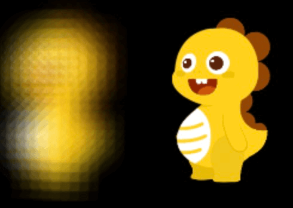

# 滤镜

## 内置

### 模糊滤镜

组件.filterBlur = 8;

### 灰度滤镜

组件.filterGrayscale = 8;

## 其他

>滤镜效果均需要设备支持webgl才能生效.

 [调整滤镜](./filters/filterAdjustment)

 [高级气球滤镜](./filters/filterAdvancedBloom)

 [透明滤镜](./filters/filterAlpha)

 [Ascii滤镜](./filters/filterAscii)

 [倒角滤镜](./filters/filterBevel)

 [气球滤镜](./filters/filterBloom)

 [模糊滤镜](./filters/filterBlur)

 [液化滤镜](./filters/filterBulgePinch)

 [色彩矩阵滤镜](./filters/filterColorMatrix)

 [Fxaa抗锯齿滤镜](./filters/filterFxaa)

 [高斯模糊滤镜](./filters/filterKawaseBlur)

 [躁点滤镜](./filters/filterNoise)

 [颜色过载滤镜](./filters/filterColorOverlay)

 [颜色替换滤镜](./filters/filterColorReplace)

 [卷积滤镜](./filters/filterConvolution)

 [破纱窗滤镜](./filters/filterCrossHatch)

 [阴极射线滤镜](./filters/filterCRT)

 [点滤镜](./filters/filterDot)

 [浮雕滤镜](./filters/filterEmboss)

 [电子脉冲滤镜](./filters/filterGlitch)

 [发光滤镜](./filters/filterGlow)

 [圣光滤镜](./filters/filterGodray)

 [动感模糊滤镜](./filters/filterMotionBlur)

 [双色替换滤镜](./filters/filterMultiColorReplace)

 [老电影滤镜](./filters/filterOldFilm)

 [描边滤镜](./filters/filterOutline)

 [像素化滤镜](./filters/filterPixelate)

 [雷达模糊滤镜](./filters/filterRadialBlur)

 [反射滤镜](./filters/filterReflection)

 [RGB分离滤镜](./filters/filterRGBSplit)

 [冲击波滤镜](./filters/filterShockwave)

 [笔刷滤镜](./filters/filterTiltShift)

 [扭曲滤镜](./filters/filterTwist)

 [径向模糊滤镜](./filters/filterZoomBlur)

 

插件扩展滤镜，参考[滤镜插件开发](filter-plugs.html)

