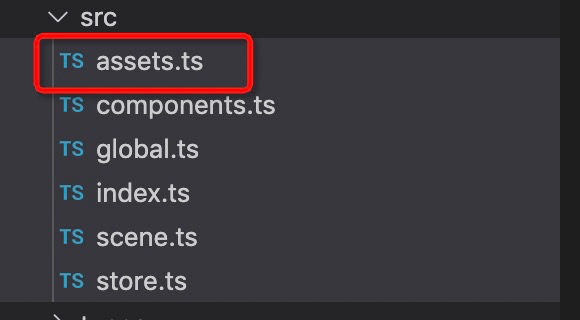

# 资源
- 图片、字体、音频、视频、纹理描述、SVG、脚本等资源文件，每个资源对应一个url。例如：jpg的图片，mp3音频文件。
``` json
"assets": {
    "0":{
        "id": 0,
        "name": "bg-homework_frame",
        "type": "image",
        "url": "assets/select1/bg-homework_frame.png"
    },
}
```
- 资源在数据中的assets节点下，assets是一个map，key是id， 值是一个object，类型如下
``` typescript
interface IAsset {
    id?: string;
    name?: string;
    type: AssetType;
    url: string;
}
```
- type 支持以下几种类型

type| 类型
--|:--:|
image | 图片
sheet | 雪碧图
svg | svg图
font | 字体
audio | 音频
video | 视频
js | 扩展内容

### 实例
1. 在数据格式中添加资源
``` json
{
    "name": "STA01",
    "version": "0.2.9",
    "width": 800,
    "height": 640,
    "fps": 24,
    "scaleMode": "showAll",
    "loadMode": "all",
    "baseUrl": "/test/",
    "assets": {
        "bg-homework":{
            "name": "bg-homework",
            "type": "image",
            "url": "assets/select1/bg-homework.png"
        },
        "playbtn":{
            "name": "playbtn",
            "type": "image",
            "url": "assets/btnsound1.png"
        },
        "sound1":{
            "name": "sound1",
            "type": "sound",
            "url": "assets/sound1.mp3"
        }
    }
}
```
2. 使用vf-cli工具中添加资源


- 在assets.ts文件中修改如下：
``` typescript
import {AssetImage} from "./store";
import {Assets} from '../types/IVFTemplate'

const assets = {
    [AssetImage.Page0]: {
        type: Assets.type.image,
        name: AssetImage.Page0.toString(),
        url: 'https://cnd-media.******.com.cn/resource/9ed039523d3b4a57b28816516937bb80.jpg?imageView2/2/w/946/format/webp'
    },
    [AssetImage.Page1]: {
        type: Assets.type.image,
        name: AssetImage.Page1.toString(),
        url: 'https://cnd-media.******.com.cn/resource/30520126b4bb45179fe59ee2a60ffbce.jpg?imageView2/2/w/946/format/webp'
    },
    [AssetImage.Page2]: {
        type: Assets.type.image,
        name: AssetImage.Page2.toString(),
        url: 'https://cnd-media.******.com.cn/resource/23c393e29c31464c893854be27a06b00.jpg?imageView2/2/w/946/format/webp'
    }

}

export default assets
```