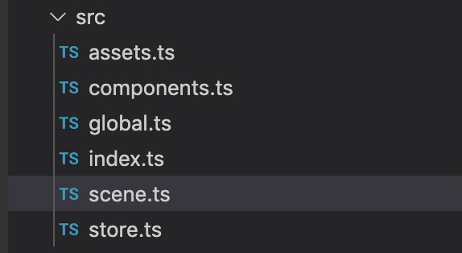

# 场景
自定义组件 + 转场 = 场景。场景就是自定义组件，只是多了个转场特效，用于制作互动故事书或者场景转换。
``` json
"scenes": [
    {
      "id": 80,
      "libId": 32,
      "transition": {
        "type": 0,
        "duration": 5000
      }
    },
    {
      "id": 81,
      "libId": 33,
      "transition": {
        "type": 0,
        "duration": 2000
      }
    }
  ]
}
```
场景数据在数据中的scenes节点。scenes是一个数组，数组中的第一个场景是默认场景，第一次进入时默认首先渲染的是第一个场景。
场景的结构定义如下：
``` typescript
export interface IScene {
    id: string;
    libId: string;
    transition?: ITransitionData;
}
```
id 是场景的id，每个场景的id不重复。
libId 是场景所要呈现的自定义组件的id
transition是转场数据，如果不写就没有转场特效。
transition的数据定义如下：
``` typescript
export interface ITransitionData {
    type: TransitionType;
    duration: number;
}
```
type支持下面几种
``` typescript
export const enum TransitionType {
    NONE = 'none',
    FADE_OUT = 'fadeOut',
    CIRCLE_WIPE = 'circleWipe',
    CROSS_ZOOM = 'crossZoom',
    DOOM_SCREEN = 'doomScreen',
    HEART_WIPE = 'heartWipe',
    LINEAR_BLUR = 'linearBlur',
    PAGE_CURL = 'pageCurl',
    TO_TEAR = 'toTear',
    WIND = 'wind',
    PAGE_FLIP_RIGHT = 'pageFlipRight',
    PAGE_FLIP_LEFT = 'pageFlipLeft',
}
```

### 实例
在数据中添加场景
``` json
"scenes": [
    {
      "id": 80,
      "libId": 32,
      "transition": {
        "type": 0,
        "duration": 5000
      }
    },
    {
      "id": 81,
      "libId": 33,
      "transition": {
        "type": 0,
        "duration": 2000
      }
    }
  ]
}
```

在vf-cli工具中添加场景

``` typescript
import {SceneId, ComponentId} from "./store";

export default [
    {
        id: SceneId.Scene1.toString(),
        libId: ComponentId.PageComponent.toString(),
        transition: {
            type: "pageFlipRight",
            duration: 2000
        }
    },
    {
        id: SceneId.Scene2.toString(),
        libId: ComponentId.PageComponent.toString(),
        transition: {
            type: "pageFlipRight",
            duration: 2000
        }
    }
]
```


#### 场景跳转
使用命令可以跳转场景，详见 [动作脚本VFX文档](./action.md)
切换场景
``` typescript
//例子
@this = {
    this.on("click", () => {
        // 跳到下一场景
        // 第一个参数 可选，过场动画 类型：
        // {
        //     type: TransitionType;
        //     duration: number;
        // }
        jumpToNextScene({type: "fadeOut", duration: 1000});
        // 跳到前一场景
        // 第一个参数 可选，过场动画
        jumpToPrevScene();
        // 跳到某一场景
        // 第一个参数 场景id
        // 第二个参数 可选，过场动画
        jumpToScene('scene1',{type: "fadeOut", duration: 1000});
    });
}
```