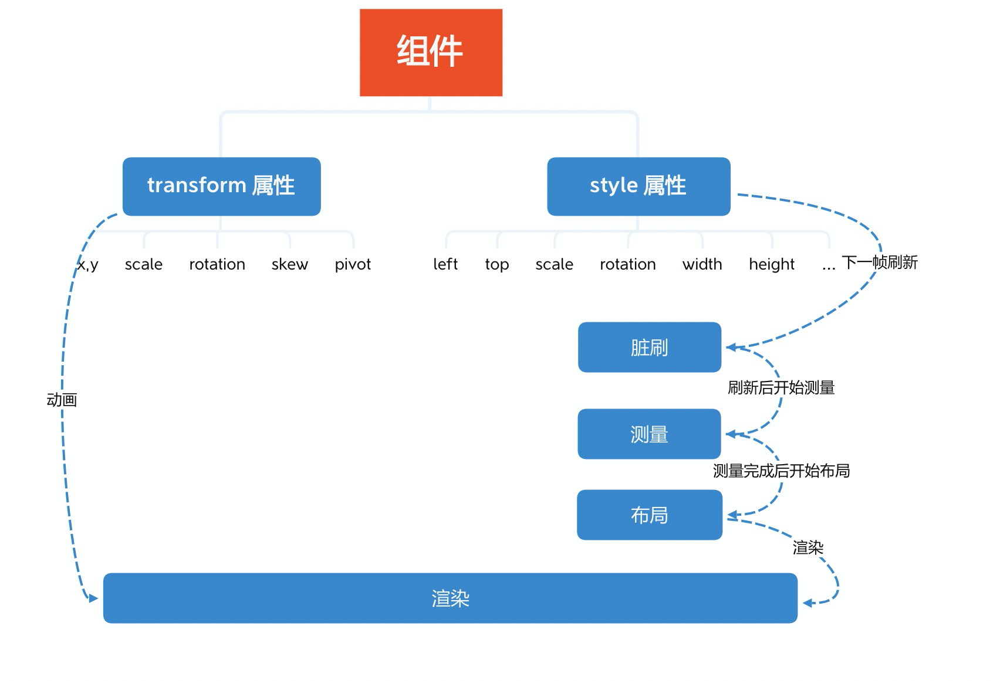

# 常见问题

## 版本更新日志

[日志列表](https://github.com/vipkid-edu/vf.js/releases)

## 稳定版与测试版本
> 版本号最后一位是奇数为测试版本，非稳定版本。

## json中的宽高应该设置多少
> json中顶层属性width,height为设计尺寸，按美术规格填写。

## json中怎么绑定显示组件
> 有些组件需要绑定显示组件，比如画线，可以通过设置其 source = 'this#child#child' 形式，source类型为字符串。

## 常规的渲染流程

